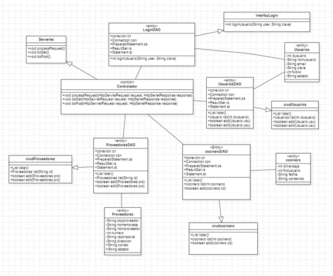

# Kankas - Pollería

## Descripción del proyecto

Diseñar e implementar el sistema que ayuda a la Pollería a no desperdiciar insumos evitando perder ganancias y haciendo más productivo el proceso.  Diseñar e implementar un sistema que se encargue de optimizar las tareas de entradas y salidas e inventario de los productos para el encargado del almacén, optimizando las tareas del gerente cuyas funciones tiene que gestionar los usuarios, proveedores y la toma de decisiones con respecto a los informes generados y a optimizar las tareas del área de cocina ya que ingresa al sistema a solicitar todos los productos faltantes. Ahorrando la intervención de un personal que sea intermediario entre estas acciones en la pollería Kankas”.

## Funcionalidades

- CRUD de los casos de uso
- Envio de pedidos.
- Verificacion doble paso.
- Estadisticas del almacen.

## Diagramas

## Capturas de pantalla

## Tecnologías utilizadas

- HTML, CSS y JSP
- Base de datos = mysql 

## Instalación

1. Clona este repositorio: `git clone https://github.com/Andrear03/PolleriaKankas.git`
2. Coloca el proyecto en tu Apache Netbeans IDE 14
3. Instala las dependencias y coloca las librerias
4. Abre el archivo `index.jsp` para correr el proyecto.

## Contribuciones

¡Las contribuciones son bienvenidas! Si deseas mejorar este proyecto, sigue los pasos a continuación:

1. Haz un fork de este repositorio.
2. Crea una nueva rama: `git checkout -b mejora-nombre`.
3. Realiza los cambios y guarda los archivos.
4. Realiza un commit con tus cambios: `git commit -m "Mejora: Descripción de los cambios"`.
5. Haz push a la rama: `git push origin mejora-nombre`.
6. Abre un pull request en este repositorio.

## Contacto

Si tienes alguna pregunta o sugerencia sobre el proyecto, no dudes en ponerte en contacto:

- Email: arandareyes.03@gmail.com

